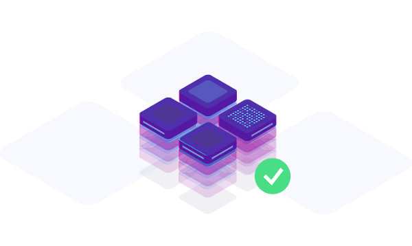

# Concepts


We recommend to start with the [Quickstart](quickstart/sign-up.md) if you want to start quickly.


In this page, you'll find information explaining how [Qovery](https://www.qovery.com) works.

The main Qovery requirement is **Git**. As you \(developer\) are already using it to manage your application code. Qovery project's configuration is driven entirely by YAML files into your Git repository.

The [Services](services/network/) and Extending Qovery sections covers those in more detail and can serve as both tutorial and quick-reference.

Qovery supports the well known [**Docker**](https://www.docker.com/) **containers** technology and a number of different [Databases](services/databases/) and other services \(available in [Services](services/network/) section\).


Databases are running on resilient and dedicated instances. [Learn more..](services/databases/)


Finally, Qovery is really fast to set up and integrates perfectly with your Git environment.

Our promise is simple:


**If your container can run locally, Qovery will run it at scale in the Cloud.**


## Git Driven Infrastructure

Qovery automatically manages everything your application needs in order to run. That means **you view your infrastructure dependencies as part of your application**. As well, **you version-control it** as part of your application.

### Simple Declarative Infrastructure 

Qovery not only covers all of your hosting needs but also **most of your DevOps needs**. It covers the application life-cycle **from development to production stage**. Ensuring as well the application is always healthy and **scales it automatically** when more workload come.

You only need to:

1. Write your code
2. Write the Dockerfile to build your application
3. Include Qovery YAML file that specify your desired infrastructure
4. Commit it to Git
5. Push it

That's it, **you don't need to setup anything manually**. Everything like the web server, the database, the CDN, the object storage etc... declared in the Qovery configuration file, will be setup and available automatically.

### Branches and environments


**Every branch you push is a fully independent environment-complete**


As a developer, for developing or testing purpose, have you never been annoyed by being **not able to get a testing environment similar to production**? 99,99% of the time, the answer is **Yes**!

That's why on any [branches](extending-qovery/branches-and-environments.md), you'll get a copy of your dependencies \(database, search index, object storage...\).

You can use these concepts to replicate a traditional development/staging/production workflow or even to **give every feature its own effective staging environment before merging to production** \(empowering you to use git-flow like methodologies even better\). You could also have an intermediary integration branch for several other branches.

A dedicated generated URL will be provided to those specific branches. This to get something as simple as:


**What my application/site looks like locally is what I'll get in production...every time.**


Qovery respects the structure of branches. It's entirely up to you.

## Technical stack \(hosting\)

Qovery relies on AWS to run components of its own infrastructure.

Qovery manages the CI/CD by its own and uses AWS services for the [Network](services/network/), [Databases](services/databases/), Brokers and Storage part.


**Our clients benefits of the best guaranties in term of stability, availability and scalability**


