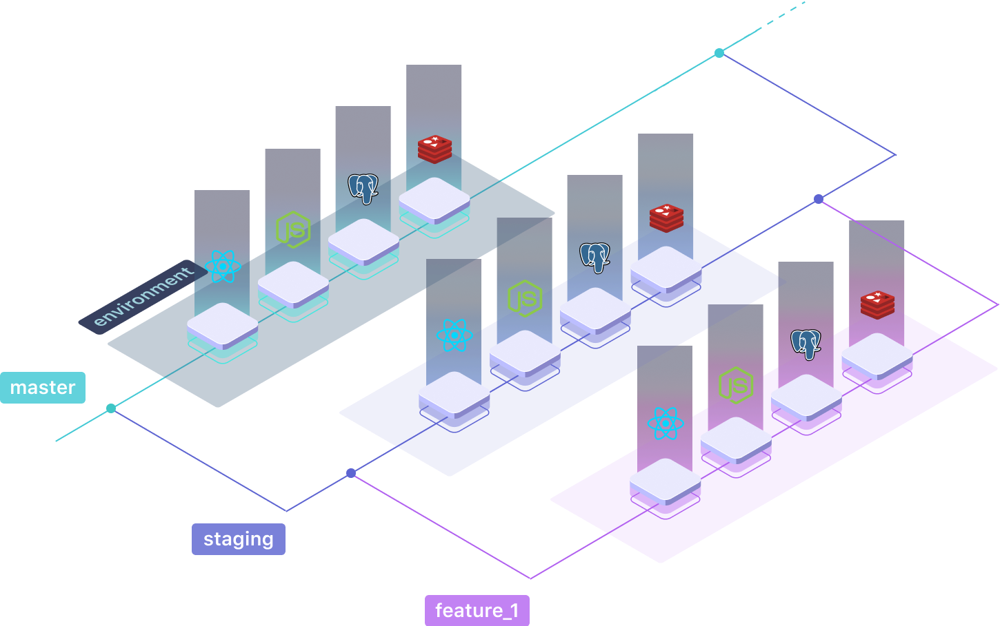

# Branches and Environments

As described in the [Qovery concepts](../concepts.md), each branch can have its own isolated environment in order to work on it without impacting the others.

By default, each branch has an environment associated with it.



If a branch is created, then a new environment is created from the data of the branch from which it was created.


## Virtual branches

In order to get a complete working environment, when a branch is created for an application, **Qovery create virtual branches automatically \(with the same branch name\)** to other applications of the same project.

The virtual branches are **created from their respective master branch**. They are **automatically updated** from their master branch, as soon as a new commit pushed on this named branch.

To make it crystal clear, here is an example where we have 2 applications in the same project:

* Both applications \(AppA and AppB\) have a master branch
* AppA create a branch named "staging"
* AppB will inherit from that branch name "staging"
* The virtual branch "staging" on AppB will be created from its own master branch
* When AppA will deploy on staging, AppB will automatically be available in the "staging" environment
* If AppA deploys a new commit on staging and AppB has new commits on its master branch, then AppB will be updated from latest commit on its "master" branch and AppA will be deployed from its last commit as well.

On a given application, **when a virtual branch already exists and a new branch with the same is created, the virtual branch is then replaced by the real new one**.

## Restrict branches deployments

To limit costs, it is possible to limit the creation of the environment to certain branches.



```yaml
application:
  name: myapp
  project: test
  active_environments:
    - master
    - staging
```



## Choose your "production" branch \(coming soon\)

By default, **the "master" branch is considered as the production branch**. However, you may have your own way to work with git and you want another branches name to be a "production" one.

To do so, simply update the Qovery configuration file this way:



```yaml
application:
  name: myapp
  project: test
  production_branches:
    - prod
```



Here, the "production" branch is called "prod".

## What is the difference between production environment and non-production environment?

The production environment use high-availability and resiliency systems for applications and databases. We guarantee that your app will scale as you need and will be available according to the AWS SLAs.

⚠️ production environments are more expensive than non-production environments

