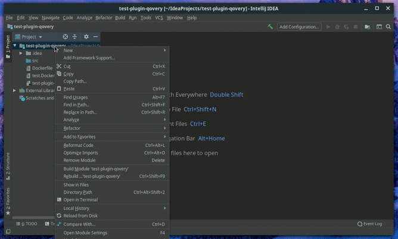
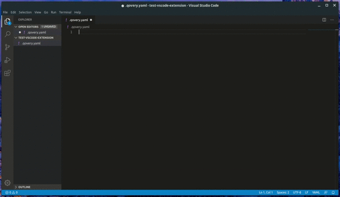

# IDE plugins

Writing Qovery configuration is simple. However you can be assisted to avoid typo mistakes, get auto-completion and write it faster by using our dedicated plugins.

## Intellij

You can easily install the Qovery Intellij plugin though the [Marketplace](https://plugins.jetbrains.com/plugin/14032-qovery) directly from your IDE \(File -&gt; Settings -&gt; Plugins -&gt; search Qovery\).

Once installed, you can see a demo here of the power of it:

## VS Code

VS Code has his module available on the [Marketplace](https://marketplace.visualstudio.com/items?itemName=qovery.vscode-qovery-extension).

Once installed, you can look at its advantages:

