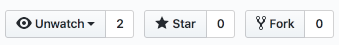

# Sample project

You'll find here a sample project to quickly run an application with a Dockerfile example.

## Fork a sample project

Fork a Qovery sample project \([https://github.com/Qovery/doc-examples](https://github.com/Qovery/doc-examples)\) by **clicking on the Fork button**:



Then, clone your repository:

```bash
$ git clone git@github.com:<your-github-nickname>/doc-examples.git
$ cd doc-examples/java/spring-boot/simple-example
```

In this repository, you'll find an already existing Dockerfile and a Qovery configuration file.

At Qovery we're using the well known Dockerfile to build multi staged containers. In the case you're not familiar with Dockerfiles, you can look to the [dedicated section here](../extending-qovery/dockerfile.md).

