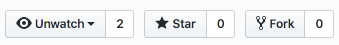

# Getting started

To show you how **Qovery is simple and fast**, here is a sample project to run an application.

## Fork a sample application

Fork a [Qovery sample application \(https://github.com/Qovery/simple-example.git\)](https://github.com/Qovery/simple-example.git) by **clicking on the Fork button**:



Once done, clone your forked repository:

```bash
$ git clone git@github.com:<your-github-nickname>/simple-example.git
$ cd simple-example
```

In this repository, you'll find an already existing [Dockerfile](../extending-qovery/dockerfile.md), able to build and run the application.

## Qovery initialization

In order to be able to deploy this application through Qovery, we have to initiate the configuration file:

```text
$ qovery init

✓ Dockerfile detected in your root directory

➤ Enter the project name: my-project

➤ Enter the application name: simple-example

➤ What port number your application is running on? (Hit enter if none): 8080

➤ Is this port accessible from other applications of the same project? (y/n): y

➤ Would you like to expose publicly your application on https? (y/n): y

➤ Do you need any database? (y/n): n

➤ Do you need any broker? (y/n): n

➤ Do you need any storage? (y/n): n

✓ Your Qovery configuration file has been successfuly created (.qovery.yml)!
✓ Commit into your repository and push it to get this deployed.
```

In your current directory, you now have a **".qovery.yml" file describing the desired configuration** you've just asked for:



```yaml
application:
  name: simple-example
  project: my-project
  private-port: 8080
  public-port: 443
```




**Commit** the .qovery.yml configuration file to save your changes


## Deploy

Are you ready to deploy?

```bash
git push
```

 That's it!!!


**We strongly encourage you to always dedicate a commit for Qovery configuration change \(in order to simplify possible rollback\)**


## Deployment status

To know what's the status of your deployment and project info, run the Qovery status command:

```bash
$ qovery status

* External DNS name               : myexample.qovery.io
* SSL/TLS enabled                 : https://myexample.qovery.io
* Current deployed version        : 7b3aeb5 (Marty McFly) / 2014-05-13 02:56
* In progress deployment          : b0b03ab (Ada Lovelace) / 75% done
* Pending deployments in the pipe : 0
* Total deployments today         : 3
* Total rollback today:           : 0
```


Your application is automatically available on https://myexample.qovery.io


## Code a new feature

As soon as you want to develop a new feature in your code, create a new branch!


**A new branch will spawn a dedicated \(production replicated\) environment for you**


To know more about it, look at the [branch dedicated page](../extending-qovery/branches.md).

## Add new services

Qovery allows you to do more by **adding new services, new functionalities and continue to simplify your developer life**.

Read the dedicated sections to know more:

* [Applications](../services/applications.md)
* [Network](../services/network/)
* [Databases](../services/databases/)
* [Brokers](../services/brokers/)
* [Storages](../services/storage/)

And feel free to look at "Extending Qovery" section to **push your application at a higher level**.


