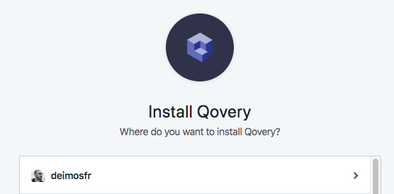
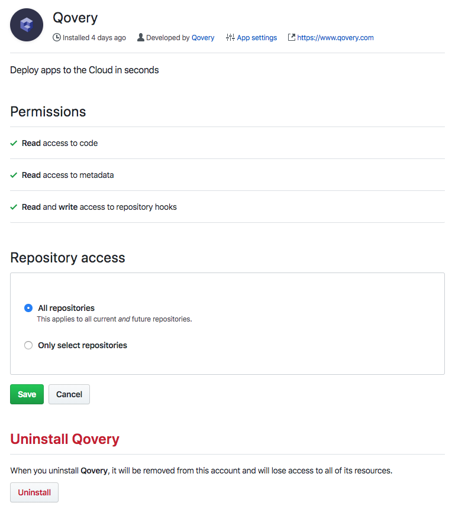

# Getting started

To show you how **Qovery is simple and fast**, here is a sample project to run an application.

## Fork a sample application

Fork a [Qovery sample application \(https://github.com/Qovery/simple-example.git\)](https://github.com/Qovery/simple-example.git) by **clicking on the Fork button**:


Once done, clone your forked repository:

```bash
$ git clone git@github.com:<your-github-nickname>/simple-example.git
$ cd simple-example
```

In this repository, you'll find an already existing [Dockerfile](../services/applications/dockerfile.md), able to build and run the application.

## Qovery initialization

In order to be able to deploy this application through Qovery, we have to initiate the configuration file:

```text
$ qovery init
Reply to the following questions to initialize Qovery for this application
For more info: https://docs.qovery.com

➤ What do you want?:
1. create a new project
2. select an existing project
➤ Your choice: 1

➤ Enter the project name: project-demo

➤ Choose the region where you want to host your project and applications:
0. none
1. aws/eu-west-3
➤ Your choice: 1

➤ Enter the application name [default: simple-example]: demo

➤ Do you need a database? (PostgreSQL, MySQL, MongoDB, ...) (y/n) [default=n]: n
✓ Your Qovery configuration file has been successfully created (.qovery.yml)

!!!IMPORTANT!!!
Qovery needs to get access to your git repository
https://github.com/apps/qovery/installations/new

➤ Would you like to open the link above? (y/n) [default=n]: y

!!!IMPORTANT!!!
1/ Commit and push the ".qovery.yml" file to get your app deployed
➤ Run: git add .qovery.yml && git commit -m "add .qovery.yml" && git push -u origin master

2/ Check the status of your deployment
➤ Run: qovery status

Enjoy! 👋
```

We need to get access to your git repository to be able to build an image container and access to your ".qovery.yml" configuration. You'll have to allow Qovery \(only the first time\) to access to it:



Then you'll see Qovery access permissions:



You may noticed that in your current directory, you now have a **".qovery.yml" file describing the desired configuration** you've just asked for:



```yaml
application:
  name: simple-example
  project: my-project
  publicly_accessible: true
routers:
- name: main
  routes:
  - application_name: simple-example
    paths:
    - /*
```



Then commit this configuration:

```bash
git add .qovery.yml
git commit -m "Adding first Qovery configuration" .qovery.yml
```

## Validate your Dockerfile and application

In order to locally **validate your Dockerfile and your application**, run this command. It will **build a Docker image and run it from your machine** with all the Qovery magic sauce:

```bash
qovery run
```

Note: This command is an equivalent to docker build and docker run but with environment variables and Qovery specificities.

## Deploy

Are you ready to deploy?

```bash
git push
```

 That's it!!!


**We strongly encourage you to always dedicate a commit for Qovery configuration change \(in order to simplify possible rollback\)**


## Deployment status

To know what's the status of your deployment and project info, run the Qovery status command:

```bash
$ qovery status

Environment
branch  status  endpoints                    applications  databases  brokers  storage
master  LIVE    https://xxxxxxxx.qovery.io   1             0          0        0

Applications
name            status  databases  brokers  storage
project-demo    LIVE    0          0        0

Databases
name  status  type  version  endpoint  port  username  password  application

Brokers
name  status  type  version  endpoint  port  username  password  application

Storage
name  status  type  version  endpoint  port  username  password  application
```


Your application is automatically available on https://xxxxxxxx.qovery.io


## Code a new feature

As soon as you want to develop a new feature in your code, create a new branch!


**A new branch will spawn a dedicated \(production replicated\) environment for you**


To know more about it, look at the [branch dedicated page](../extending-qovery/branches-and-environments.md).

## Want more?

Qovery allows you to do more by **adding new services, new functionalities and continue to simplify your developer life**.

Read the dedicated sections to know more:

* [Applications](../services/applications/)
* [Network](../services/network/)
* [Databases](../services/databases/)
* Brokers \(coming soon\)
* Storages \(coming soon\)

And feel free to look at "Extending Qovery" section to **push your application at a higher level**.

