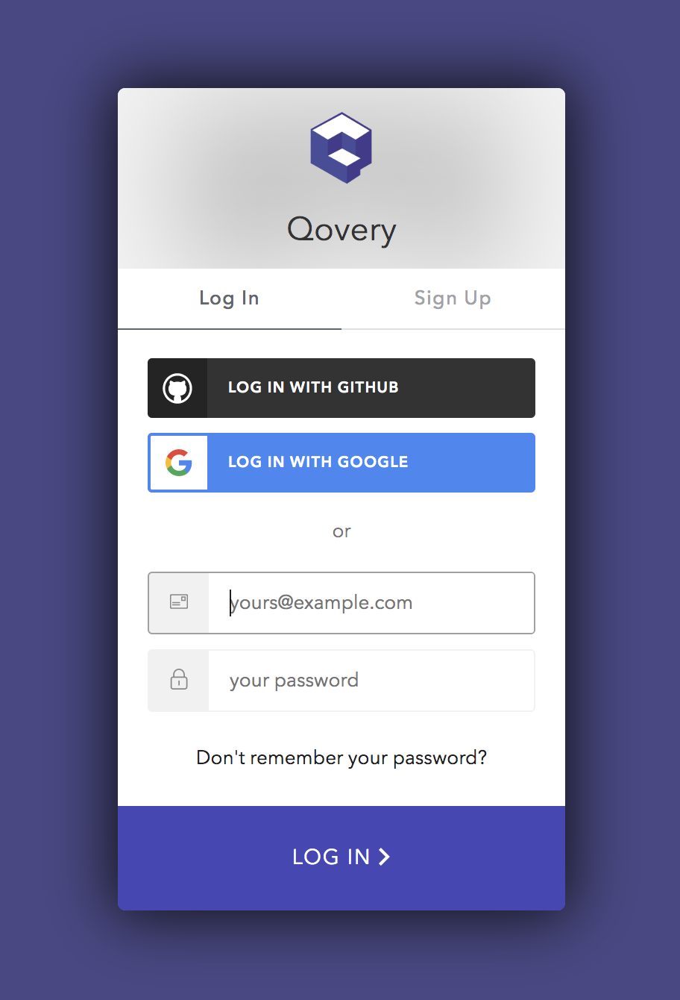
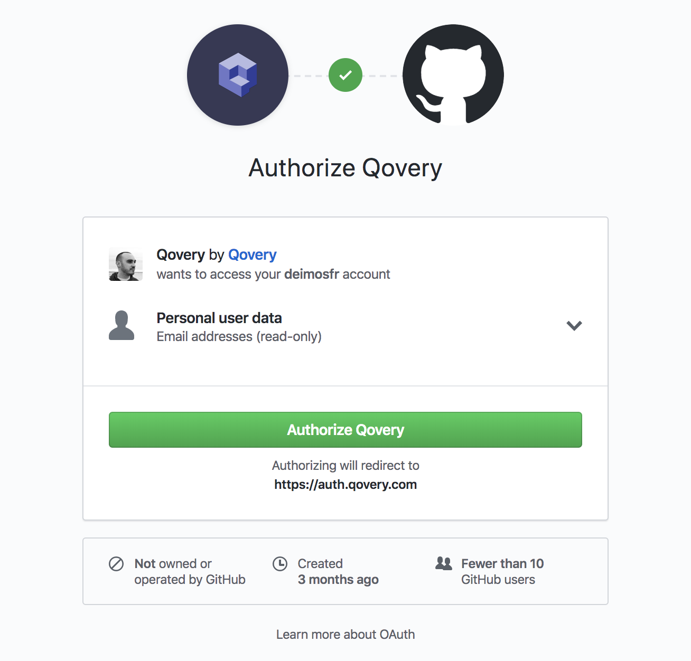
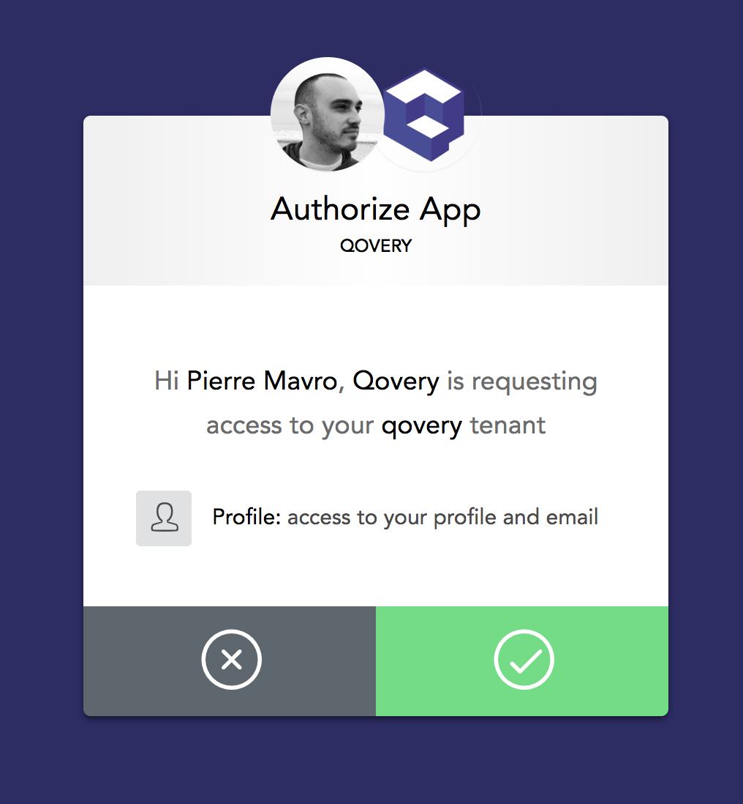

# Sign Up

To sign up using [Qovery CLI](../extending-qovery/cli.md), it's simple:


First of all,[ **install Qovery CLI**](../extending-qovery/cli.md).


Then, run this command:

```text
qovery auth
```

You'll get a window open on your browser to link with your account. In this example we chose GitHub :



We need to access to your account to be able to clone your repository for future application build:



Then we need to validate it on our side:



That's it, you should have a message saying: "_Authentication successful. You can close this window_."

