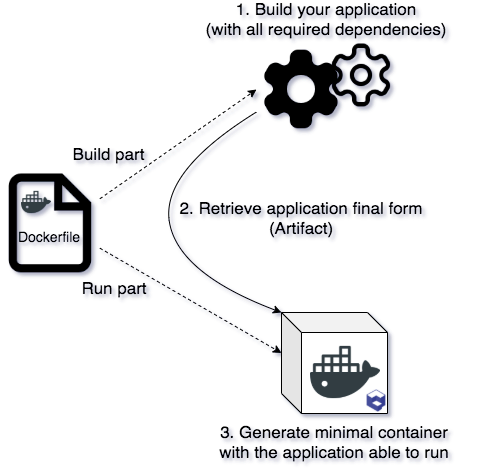

# Dockerfile

This page explains how to generate a Dockerfile and how to define its content. This to build and run your application on Qovery.

## Define the build and run process

We'll need to first build the application and then create a dedicated minimal container with the application embedded.



Here is [an example of a Dockerfile](https://github.com/Qovery/doc-examples/blob/master/java/spring-boot/simple-example/Dockerfile) to build a Java application:



```bash
# Build your application with this image called "build"
FROM openjdk:8-alpine AS build

# Add the required packages
RUN apk update && apk upgrade && apk add bash

# Add your specifc dependencies
RUN cd /usr/local/bin && \
    wget https://services.gradle.org/distributions/gradle-5.6-all.zip && \
    /usr/bin/unzip gradle-5.6-all.zip && \
    ln -s /usr/local/bin/gradle-5.6/bin/gradle /usr/bin/gradle

# Copy your code in the build container and move into it
RUN mkdir -p /app
COPY . /app
WORKDIR /app

# Build your application
RUN gradle build -x test

# The container that will run
FROM openjdk:8-alpine AS run

# Choose the port to publicly expose to the internet
EXPOSE 8080

# Add required packages
RUN apk update && apk upgrade && apk add shadow

# Create a dedicated user to run your app with (for security reasons)
RUN useradd -ms /bin/bash qovery
USER qovery

# Get the build artifact (can be a folder)
COPY --from=build /app/build/libs/simple-example-1.0.jar /app.jar

# Set specific environment variables
ENV JAVA_OPTS=""
# Command to run your application
CMD exec java $JAVA_OPTS -jar /app.jar
```



1. **Build**: The first part \(from the first line to 15\) represent the dependencies and requirements in order to **build the application**. The application final form is called an **artifact** available in the `/app/build/libs/app.jar` directory.
2. **Run**: The second part \(from line 18 to last\) represent the content of the container that will **run on Qovery**. It retrieves the artifact from the build part and store it in the container to be run.


**For security reasons**, for we strongly advise you to:

1. Use [Docker **Official** Images](https://hub.docker.com/search/?q=&type=image&image_filter=official) ****or [**Distroless**](https://github.com/GoogleContainerTools/distroless) images
2. Use the **lightest image** as possible such as [Distroless](https://github.com/GoogleContainerTools/distroless), [Scratch](https://hub.docker.com/_/scratch), [Debian-slim](https://hub.docker.com/_/debian) or [Alpine](https://hub.docker.com/_/alpine)
3. Never run your application **with root user** but **a** [**dedicated user instead**](https://docs.docker.com/engine/reference/builder/#user)\*\*\*\*


## Validate your Dockerfile

You can validate your Dockerfile by running a build on your machine.


You need to have [Docker binary installed](https://docs.docker.com/install/) on your computer to validate the build


You simply have to run this command:

```bash
qovery run
```

## Other references

* [Dockerfile reference](https://docs.docker.com/engine/reference/builder/)
* [Multi stages Dockerfiles](https://docs.docker.com/develop/develop-images/multistage-build/)

