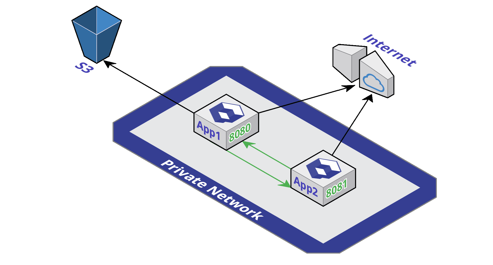
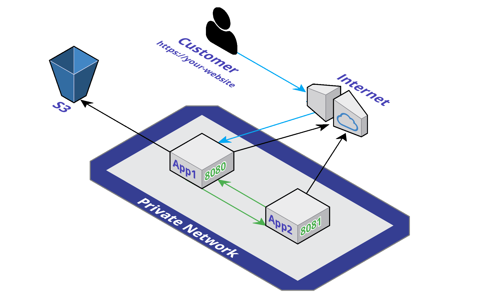

# Network

On your Qovery project, you can configure the way your applications are accessible from the [outside \(internet\)](./#public-access) or in a [private, dedicated and secure way](./#private-access) with other applications from the same project.


**By default the access to your application network is private. Nothing outside your project can access to your applications until you explicitly specified it.**


## Private Access

By default, exposed ports in your Dockerfile \([EXPOSE instruction](https://docs.docker.com/engine/reference/builder/#expose)\) are visible by others applications **of the same project**.



Here is an example Dockerfile with Expose:



```bash
# Build your application with this image called "build"
FROM adoptopenjdk/openjdk8:alpine AS build
RUN apk update && apk upgrade && apk add bash
RUN cd /usr/local/bin && \
    wget https://services.gradle.org/distributions/gradle-5.6-all.zip && \
    /usr/bin/unzip gradle-5.6-all.zip && \
    ln -s /usr/local/bin/gradle-5.6/bin/gradle /usr/bin/gradle
RUN mkdir -p /app
COPY . /app
WORKDIR /app
RUN gradle build -x test

# The container that will run
FROM adoptopenjdk/openjdk8:alpine-slim
# Here expose port is used
EXPOSE 8080
COPY --from=build /app/build/libs/simple-example-1.0.jar /app.jar
ENV JAVA_OPTS=""
CMD exec java $JAVA_OPTS -jar /app.jar
```



## Public Access

To allow public access on a specific application port, you first need to be sure that you exposed the port \(in the Dockerfile\) as described in the "[Private Access](./#private-access)" section of this page.



Then you have to declare in the Qovery configuration file \(.qovery.yaml\), the desired port for external access \(here 80, the http port\):



```yaml
application:
  name: myapp
  project: test

network:
  public-port: 80
```



### Multiple public ports

If you have multiple ports to publicly expose, you need to use "public-ports" instead. Here is an example:



```yaml
application:
  name: myapp
  project: test

network:
  public-ports:
    - public-port: 8080
      private-port: 80
    - public-port: 8080
      private-port: 443
    - public-port: 8081
      private-port: 1234
```



To explain it simply:

* The port exposed 8080 on the private network, is publicly exposed to the port 80 and 443
* The port exposed 8081 on the private network, is publicly exposed to the port 1234

