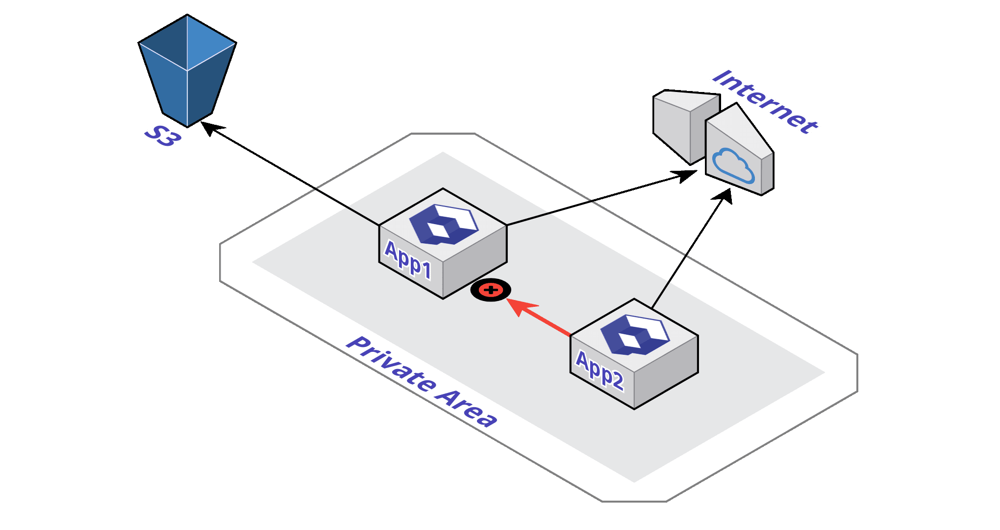

# Network

On your Qovery project, you can configure the way your applications are accessible from the [outside \(internet\)](./#public-access) or in a [private, dedicated and secure way](./#private-access) with other applications from the same project.


**By default the access to your application network is closed. Nobody can access to your applications until you explicitly specified it.**


## Closed Access

This is the default behavior, **you don't have anything to do**.


Nobody is able to talk to your application but it can talk to anyone


Here App1 can't be contacted by App2, but App1 is able to use S3 and Internet.



If your application **do not have to listen to a port** \(eg: pure computing or consuming external API or storing some content in [S3](../storage/s3.md)...\) you may not need to expose any kind of port. 

## Private Access

In the case you have **several applications running in the same Qovery project**, you may need to have applications talking together in a **private, dedicated and secure area**.


For example, your application "App2" needs to talk to another running application "App1". The "App1" application has to expose its own running port.

To do so, in the Qovery configuration file \(.qovery.yml\) of the "App1" application, add the "private-port" line:



```yaml
app:
  name: myapp
  project: test
  private-port: 8080
```



Here the port "8080" will be securely exposed to other applications. In order to target "App1" application, "App2" application has to point to "App1:8080".

### Multiple private ports

If you have multiple ports to privately expose to other applications of the same dedicated area, you need to use "private-ports" instead. Here is an example:



```yaml
application:
  name: myapp
  project: test
  private-port:
    - 8080
    - 8081
```



## Public Access

To allow public access on a specific application port, you have to first expose the port as described in the "[Private Access](./#private-access)" section of this page.


Then you have to declare in the Qovery configuration file \(.qovery.yaml\), the desired port for external access \(here 80, the http port\):



```yaml
application:
  name: myapp
  project: test
  private-port: 8080
  public-port: 80
```



### Multiple public ports

If you have multiple ports to publicly expose, you need to use "public-ports" instead. Here is an example:



```yaml
application:
  name: myapp
  project: test
  private-port: [ 8080, 8081 ]
  public-ports:
    - public-port: 8080
      private-port: 80
    - public-port: 8080
      private-port: 443
    - public-port: 8081
      private-port: 1234
```



To explain it simply:

* The port exposed 8080 on the private network, is publicly exposed to the port 80 and 443
* The port exposed 8081 on the private network, is publicly exposed to the port 1234

