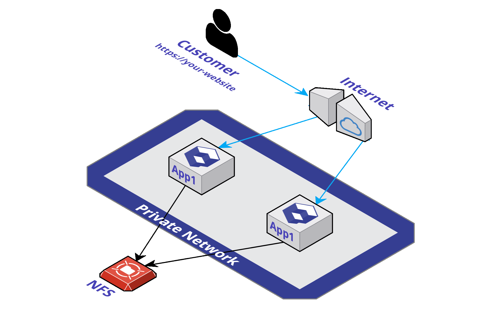

# NFS

[Network File System \(NFS\)](https://en.wikipedia.org/wiki/Network_File_System) is a **distributed file system** protocol, allowing a user on a client computer to access files over a computer network much like local storage is accessed.



To enable NFS, edit the Qovery configuration file and add this:



```yaml
application:
  name: myapp
  project: test
  nfs:
    - name: my-shared-data
      mount-point: /mnt/data
  
storage:
  - name: my-shared-data
    type: nfs
```



As you can see, there is a declared storage called "my-shared-data". Then to allow your application to use it in the desired mount point, you have to request it in the "application" section.

Once done, the NFS share will be accessible from "/mnt/data" directory.

