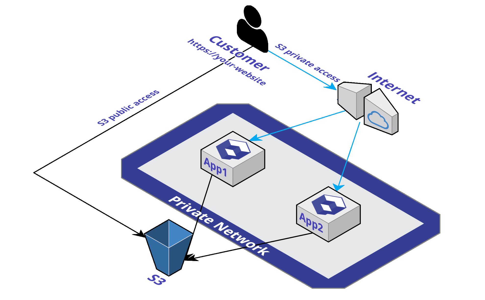

# Object storage \(S3\)

[Object storage](https://en.wikipedia.org/wiki/Object_storage) \(also known as S3\), is a service that provides **object storage through a web service interface**. It can be employed to store any type of object which allows for uses like storage for Internet applications, backup and recovery, data archives, data lakes for analytics, and hybrid cloud storage.



## Add a new bucket

To create an Object storage bucket, simply add those lines in the Qovery configuration file:



```yaml
application:
  name: myapp
  project: test
...
storage:
  - name: s3-images
    type: object-storage
    bucket: images
    public-access: no
```



## Access to a bucket

The following samples give you the way to access all necessaries information to access your Object Storage bucket.



```javascript
const { Pool } = require('pg');
const { Qovery } = require('qovery');

const dbConfiguration = new Qovery().databaseConfiguration();

const pool = new Pool({
    host: dbConfiguration.host,
    port: dbConfiguration.port,
    user: dbConfiguration.user,
    password: dbConfiguration.password,
    database: 'test', 
});

// your code
```



```java
package com.qovery.languages.sample;

import com.qovery.Qovery;
import com.qovery.DatabaseConfiguration;

import javax.sql.DataSource;
import java.sql.Connection;
import java.sql.DriverManager;
import java.sql.ResultSet;
import java.sql.SQLException;

public class PostgreSQLSample {

    @Override
    public String get() {
        // Create a new config object to ease reading the Qovery environment variables.
        // You can alternatively use getenv() yourself.
        Qovery qovery = new Qovery();

        // "my-super-instance" is the database name instance to access
        DatabaseConfiguration config = qovery.getDatabaseConfiguration("my-super-instance");
        
        // your database name
        String databaseName = "test";

        // connection URI string
        String uri = "jdbc:postgresql://" + 
            config.getHost() + ":" + 
            config.getPort() + "/" + 
            databaseName;

        // Connect to the database
        try (Connection connection = DriverManager.getConnection(uri, config.getUsername(), config.getPassword())) {
            // your code here :)
        } catch (SQLException exp) {
            throw new RuntimeException("An error when execute PostgreSQL", exp);
        }
    }
}
```



## Get buckets status

To know more about your bucket status, you can do it this way:

```bash
$ qovery status storage

✓ s3-images:
* Branch  : master (Production)
* Health  : healthy
* Type    : Object Storage
```

## Delete a bucket

To delete a bucket, there are 2 ways to do it, depending on the scenario you are.


**Delete action will drop the bucket and its data!**



**Backups will be kept for 1 month if you need to recover \(just in case**😉**\)**


### Delete for all branches

If you want to **delete a bucket with its data.** You simply have to **delete the corresponding Qovery configuration** in your YAML file.



```yaml
application:
  ...
storage:
  - name: s3-images
    type: object-storage
    bucket: images
    public-access: no
```



### Delete for one branch

Once you've finished to work on a feature branch, simply delete the branch and **the bucket will automatically be delete** as well.

